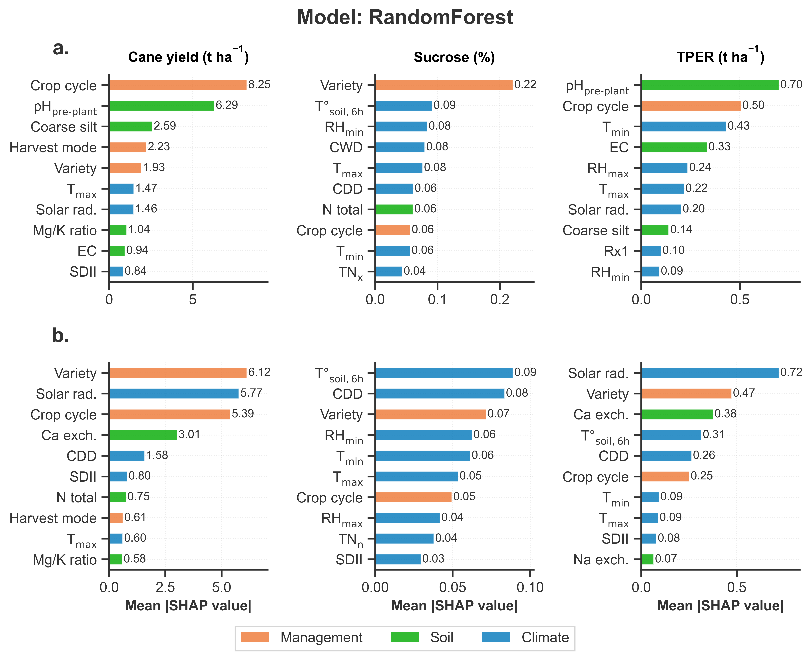
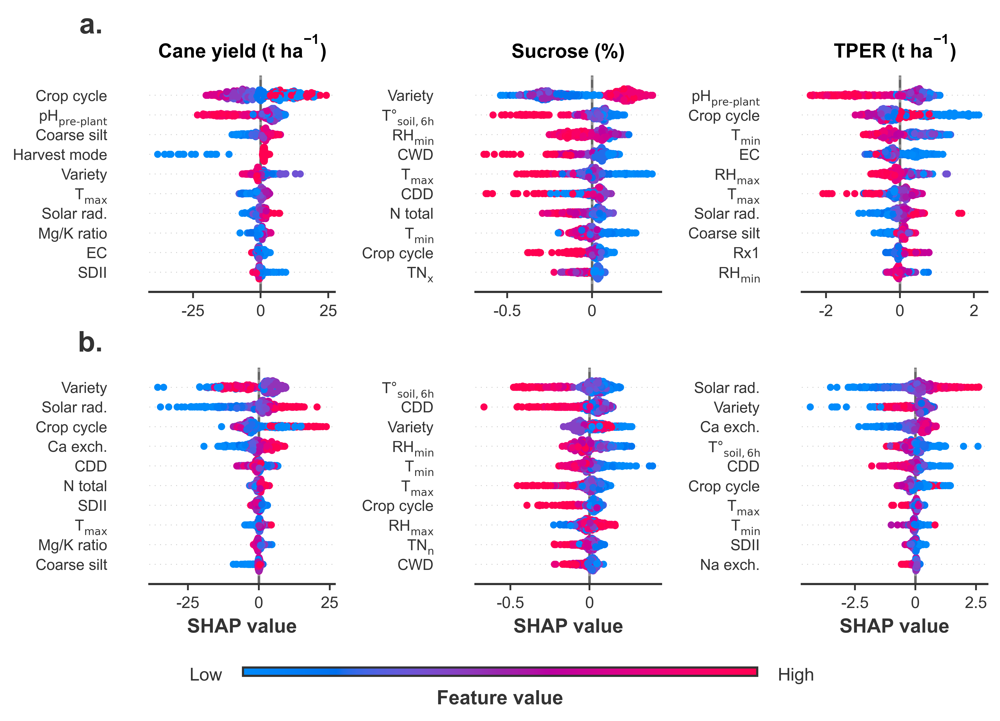
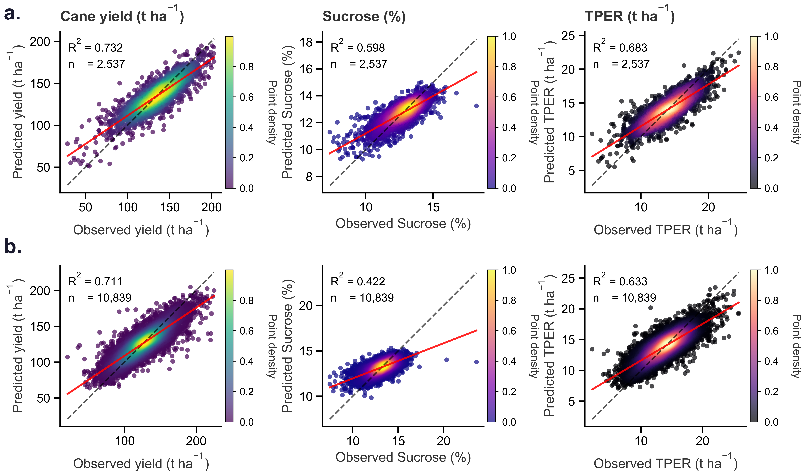

# Sugarcane Yield Modeling: Spatial Data Fusion and Machine Learning

**Last name:** Randrianantenaina  
**First name:** Antsa Sarobidy  

**Affiliations:**

1. École Supérieure des Sciences Agronomiques (ESSA), Université d’Antananarivo, Route d’Ambohitsaina, BP 175, Antananarivo 101, Madagascar
2. Faculté des Sciences et Ingénierie, Sorbonne Université, 4 Place Jussieu, 75005 Paris, France
3. CIRAD, UPR Recyclage et risque, F-34398 Montpellier, France
4. Recyclage et risque, CIRAD, Université de Montpellier, Montpellier, France

**Date:** 2026

This repository contains the full analysis pipeline developed to study sugarcane yield variability across irrigated plantation blocks, combining soil, rainfall and weather data. The work is split in two stages that live in two languages: data preparation and spatial imputation are done in R (mainly through R-INLA), and the predictive modeling / interpretability work is done in Python (scikit-learn, XGBoost, LightGBM, CatBoost, SHAP).

The reason for splitting the repository this way is simple: the spatial statistics part (Bayesian spatial imputation of soil properties, missing data reconstruction, compositional data handling) is something R-INLA does far better than anything currently available in Python, while the supervised learning part (gradient boosting, random forests, feature importance, partial dependence) is more mature and easier to maintain in the Python ecosystem. Rather than forcing everything into one language, the pipeline uses each tool where it is strongest, and the two stages communicate through flat files (CSV / GeoPackage) written to disk between steps.

## Table of contents

- [Project context](#project-context)
- [Repository structure](#repository-structure)
- [Pipeline overview](#pipeline-overview)
- [Methodology](#methodology)
  - [Spatial imputation with a conditional autoregressive model](#spatial-imputation-with-a-conditional-autoregressive-model)
  - [Compositional data and the isometric log-ratio transform](#compositional-data-and-the-isometric-log-ratio-transform)
  - [Principal component analysis](#principal-component-analysis)
  - [Feature selection: RFE and VIF](#feature-selection-rfe-and-vif)
  - [Machine learning models and evaluation metrics](#machine-learning-models-and-evaluation-metrics)
  - [Model interpretability with SHAP](#model-interpretability-with-shap)
- [Installation](#installation)
- [How to run this](#how-to-run-this)
- [Data](#data)
- [Citation](#citation)
- [License](#license)
- [Contact](#contact)

## Project context

The study area is a sugarcane plantation divided into parcels ("parcelles") grouped into blocks, under two irrigation regimes: gravity irrigation (referred to as GRV in the code and plots) and drip irrigation (referred to as GAG, from the French "goutte a goutte"). For each parcel and each growing campaign, the following are recorded or measured:

- Yield and quality variables: cane tonnage per hectare, estimated recoverable sugar (pol), sucrose content, and the derived variable TPER (recoverable sugar yield in tonnes per hectare), computed as

$$
\text{TPER} = \frac{\text{estimated recoverable pol (\%)} \times \text{cane yield (t/ha)}}{100}
$$
- Soil physicochemical properties, including granulometry fractions (sand, silt, clay), organic matter, pH, and exchangeable cations, sampled irregularly in time and space.
- Daily and monthly rainfall from a small network of stations, with a non-trivial amount of missing data.
- Weather variables: temperature, humidity, evaporation.

None of these datasets line up cleanly. Soil samples are sparse and not systematically repeated every year, rainfall stations have gaps, and the spatial unit of analysis (the parcel) changes shape and identity over time as blocks get replanted or subdivided. A large part of this repository is dedicated to reconciling these datasets before any model ever sees them, which is why the preprocessing side is almost as large as the modeling side.

## Repository structure

```
sugarcane-yield-modeling/
├── README.md
├── CITATION.cff
├── LICENSE
├── requirements.txt
├── .gitignore
├── R/
│   └── install_packages.R
├── data_preprocessing_R/
│   ├── README.md
│   ├── 01_yield_data_preprocessing.qmd
│   ├── 02_soil_data_preprocessing.qmd
│   ├── 03_rainfall_data_preprocessing.qmd
│   ├── 04_weather_data_preprocessing.qmd
│   ├── 05_inla_spatial_preprocessing.qmd
│   ├── 06_inla_modelling.qmd
│   ├── 07_inla_cross_validation_granulometry_correction.qmd
│   ├── 08_pca_analysis_and_results_plotting.qmd
│   ├── 09_data_fusion.qmd
│   └── 10_inla_standalone_script.qmd
├── ml_modeling_python/
│   ├── README.md
│   ├── 01_feature_selection_rfe_vif.ipynb
│   ├── 02_data_visualization.ipynb
│   ├── 03_ml_modelling_combined_dataset.ipynb
│   └── 04_ml_modelling_by_irrigation_type.ipynb
└── docs/
    └── figures/
```

Each `.qmd` file is a [Quarto](https://quarto.org/) document (plain R code with Markdown narration, renders to HTML/PDF). Each `.ipynb` is a standard Jupyter notebook. Both are meant to be read top to bottom; they are numbered in the order they are meant to run.

## Pipeline overview

```
                         ┌────────────────────────────┐
                         │   Raw source data (CSV,     │
                         │   GeoPackage, station logs)  │
                         └──────────────┬───────────────┘
                                        │
              ┌────────────┬───────────┼────────────┐
              ▼            ▼           ▼             ▼
         01_yield     02_soil     03_rainfall   04_weather
         (R, dplyr)   (R, dplyr)  (R, ggplot2)  (R)
              │            │           │             │
              └────────────┴───────────┴─────────────┘
                                         ▼
                          05_inla_spatial_preprocessing
                        (shapefile cleanup, neighbourhood
                         weights matrix W, irrigation labels)
                                         ▼
                             06_inla_modelling
                       (Besag CAR spatial model per soil
                        variable, per campaign, gap filling)
                                         ▼
                07_inla_cross_validation_granulometry_correction
                    (5-fold CV of the imputation, ILR-transformed
                          compositional correction for sand/silt/clay)
                                         ▼
                        08_pca_analysis_and_results_plotting
                       (dimensionality check on the imputed soil
                                  space, diagnostic plots)
                                         ▼
                              09_data_fusion
                    (merge imputed soil surface with sugarcane
                        yield table -> single analysis-ready table)
                                         │
                                         ▼
               ══════════════ hands off to Python ══════════════
                                         │
                                         ▼
                        01_feature_selection_rfe_vif
                    (drop collinear predictors, rank predictors
                              by recursive elimination)
                                         ▼
                          02_data_visualization
                     (descriptive statistics, temporal trends,
                        boxplots by irrigation type and block)
                                         ▼
              03_ml_modelling_combined_dataset  &  04_ml_modelling_by_irrigation_type
                (K-fold CV benchmarking of 10+ regressors, SHAP,
                    partial dependence, stratified analysis GRV vs GAG)
```

`10_inla_standalone_script.qmd` is kept separate from the numbered chain: it is a self-contained version of the imputation step (train/validation split instead of 5-fold CV) that was used to sanity-check the compositional (ILR) treatment of the granulometry fractions in isolation, before it was folded into step 07. It is included for transparency, not because it needs to be re-run.

## Methodology

### Spatial imputation with a conditional autoregressive model

Soil sampling is sparse: not every parcel is sampled every year. To reconstruct a complete soil surface over the whole plantation and over time, each soil variable is modeled as a Bayesian conditional autoregressive (CAR) process using the Besag specification, fit with R-INLA (integrated nested Laplace approximation, an alternative to MCMC that is considerably faster for these latent Gaussian models).

For a soil variable observed on parcel $i$, the model has the form

$$
Y_i = \beta_0 + X_i \beta + \phi_i + \varepsilon_i
$$

where $X_i$ are fixed covariates (block, irrigation type, campaign), $\phi_i$ is a spatially structured random effect attached to parcel $i$, and $\varepsilon_i$ is unstructured (i.i.d.) noise. The spatial effect follows an intrinsic Besag prior:

$$
\phi_i \mid \phi_{-i} \sim \mathcal{N}\left( \frac{1}{n_i} \sum_{j \sim i} \phi_j,\ \frac{1}{n_i \tau} \right)
$$

meaning the expected value of the effect at parcel $i$ is the average of its neighbours' effects, where "neighbour" ($j \sim i$) is defined through a binary adjacency (contiguity) matrix $W$ built from parcel boundary distances (two parcels are neighbours if their boundaries are close enough, see `06_inla_spatial_preprocessing.qmd`), $n_i$ is the number of neighbours of parcel $i$, and $\tau$ is a precision hyperparameter controlling how strongly neighbouring parcels are pulled toward each other. The precision is given a weakly informative log-gamma prior,

$$
\theta \sim \text{logGamma}(1,\ 0.005)
$$

which is the INLA default recommended for CAR precision parameters. This is the classical Besag-York-Mollie style formulation used in disease mapping and agricultural spatial statistics, applied here parcel-by-parcel and campaign-by-campaign so that a missing soil measurement on a given parcel in a given year can borrow information both from its spatial neighbours and from the same parcel in other years.

The imputation is validated with a 5-fold cross-validation scheme (`08_inla_cross_validation_granulometry_correction.qmd`): observed values are randomly withheld in folds, re-predicted from the CAR model fit on the remaining data, and compared against the true withheld values using RMSE and R-squared.

### Compositional data and the isometric log-ratio transform

Soil granulometry fractions (percentage sand, silt, clay) are compositional: they are strictly positive and sum to 100 percent by construction. Running a standard Gaussian CAR model directly on percentages is not correct, because it ignores this sum constraint and can predict values outside the simplex (e.g. a negative percentage, or fractions that no longer sum to 100). Instead, the three fractions are mapped into unconstrained real space using an isometric log-ratio (ILR) transform before imputation, and mapped back afterwards.

For a composition with $D$ parts $x = (x_1, \dots, x_D)$, an ILR basis $V$ is built (an orthonormal basis of the simplex expressed in log-ratio coordinates), and the transform is

$$
\text{ilr}(x) = V \log(x)
$$

with the inverse given by

$$
x = \text{closure}\left( \exp\left( V^{\top}\, \text{ilr}(x) \right) \right)
$$

where $\text{closure}(\cdot)$ rescales the vector so its components sum back to 1. In this repository the basis $V$ is constructed row by row, for $i = 1, \dots, D-1$, as

$$
V_{i,\,1:i} = \frac{1}{i}, \qquad V_{i,\,i+1} = -1, \qquad V_{i,\,\cdot} \leftarrow V_{i,\,\cdot} \sqrt{\frac{i}{i+1}}
$$

which is the standard sequential binary partition construction of the ILR basis (see `Script_INLA.qmd` and `08_inla_cross_validation_granulometry_correction.qmd`). The CAR spatial imputation described above is then run on the ILR coordinates rather than on the raw percentages, and the fitted values are transformed back to percentages with the inverse map, guaranteeing that the three imputed fractions always sum to 100.

### Principal component analysis

Once the soil surface is complete, `09_pca_analysis_and_results_plotting.qmd` runs a standard PCA on the (scaled) set of soil and yield variables to check redundancy and get a low-dimensional summary of the main axes of variation before merging everything into the modeling table. For a data matrix $X$ with variables centered and scaled to unit variance, PCA finds the eigen-decomposition of the correlation matrix:

$$
\text{Corr}(X) = V \Lambda V^{\top}
$$

where the columns of $V$ are the loadings (eigenvectors) and the diagonal of $\Lambda$ holds the variance explained by each component (eigenvalues $\lambda_1 \geq \lambda_2 \geq \dots$, in decreasing order). The proportion of variance explained by component $k$ is

$$
\text{PVE}_k = \frac{\lambda_k}{\sum_{m} \lambda_m}
$$

and the number of components required to reach 80/90/95 percent cumulative variance is reported directly in the notebook as a quick sanity check on dimensionality.

### Feature selection: RFE and VIF

Before fitting the machine learning models, `01_feature_selection_rfe_vif.ipynb` performs two complementary checks.

Recursive Feature Elimination (RFE) fits a model (a random forest here), ranks predictors by importance, discards the weakest one, and repeats until a target number of features is reached, wrapped in K-fold cross-validation (RFECV) to pick the number of features that maximizes out-of-fold performance rather than a number fixed in advance.

Variance Inflation Factor (VIF) flags multicollinearity among the remaining predictors. For predictor $j$, VIF is computed by regressing it on all the other predictors and taking

$$
\text{VIF}_j = \frac{1}{1 - R_j^2}
$$

where $R_j^2$ is the R-squared of that auxiliary regression. A VIF above 5 or 10 (both thresholds are commonly used; the notebook reports the raw values so the cutoff can be adjusted) signals that a predictor carries little information beyond what is already captured by the others, which matters for models sensitive to correlated inputs (e.g. linear and ridge regressions) even if it matters less for tree-based ensembles.

### Machine learning models and evaluation metrics

The core modeling notebooks (`03_ml_modelling_combined_dataset.ipynb` and `04_ml_modelling_by_irrigation_type.ipynb`) benchmark the same family of regressors on the yield / TPER response variable:

- Linear models: Linear Regression, Ridge, Lasso, Elastic Net
- Instance-based: K-Nearest Neighbours
- Kernel-based: Support Vector Regression
- Trees and ensembles: Decision Tree, Random Forest, Extra Trees, Gradient Boosting, Bagging, Voting and Stacking regressors
- Gradient boosting libraries: XGBoost, LightGBM, CatBoost
- Neural network: a small Multi-Layer Perceptron regressor

All models are compared under the same K-fold cross-validation protocol (`sklearn.model_selection.KFold` + `cross_validate`), with predictors standardized (`StandardScaler`) where the model is scale-sensitive, and the same three metrics reported for every model:

$$
\text{RMSE} = \sqrt{ \frac{1}{n} \sum_{i=1}^{n} (y_i - \hat{y}_i)^2 }
$$

$$
\text{MAE} = \frac{1}{n} \sum_{i=1}^{n} \left| y_i - \hat{y}_i \right|
$$

$$
R^2 = 1 - \frac{\displaystyle\sum_{i=1}^{n} (y_i - \hat{y}_i)^2}{\displaystyle\sum_{i=1}^{n} (y_i - \bar{y})^2}
$$

`04_ml_modelling_by_irrigation_type.ipynb` repeats the whole benchmarking pipeline separately for gravity-irrigated (GRV) and drip-irrigated (GAG) parcels, because the yield response to soil and weather predictors is expected (and confirmed in the results) to differ by irrigation system, and pooling both together would average away that difference. A stacking regressor combining the best individual models is also fit and compared against the individual learners.

### Example results

The figures below come out of `04_ml_modelling_by_irrigation_type.ipynb` and illustrate the kind of output the pipeline produces for a single model (Random Forest, shown here as an example; the notebooks run the same analysis for every model in the benchmark).

**SHAP feature importance (bar plot)**

Mean absolute SHAP value for the top 10 predictors of cane yield, sucrose content and TPER. Row (a) is the pooled dataset, row (b) is split by irrigation regime. Bars are colored by variable category (management, soil, climate).



**SHAP value distribution (beeswarm)**

Same ranking as above, but showing every observation's individual SHAP value rather than just the mean. Each dot is one observation, colored by that observation's value for the feature (blue is low, pink is high), so the plot shows both which variables matter and which direction they push the prediction.



**Observed vs. predicted values**

Density-colored scatter of predicted against observed cane yield, sucrose and TPER, with R-squared and sample size reported against the 1:1 line. Row (a) and row (b) correspond to the two irrigation regions (GAG and GRV).



### Model interpretability with SHAP

Because the point of this analysis is agronomic, not just predictive accuracy, every fitted model of interest is passed through SHAP (SHapley Additive exPlanations) to get per-feature, per-observation contributions to the prediction. SHAP assigns each feature $j$ a contribution $\phi_j$ to a given prediction such that the sum of contributions plus a baseline recovers the model output:

$$
f(x) = \phi_0 + \sum_{j=1}^{M} \phi_j
$$

with $\phi_0$ the average model prediction over the training set and $\phi_j$ computed as the average marginal contribution of feature $j$ over all possible orderings of features (the Shapley value from cooperative game theory). In practice, the tree-based models here use the fast exact TreeSHAP algorithm rather than the exponential brute-force computation. The notebooks use SHAP summary/beeswarm plots and SHAP heatmaps to rank predictors by importance and show the direction of their effect, and complement this with Partial Dependence Plots (PDP), which show the marginal effect of a single predictor (or a pair, for 2D PDP) on the predicted yield, averaged over the distribution of all other predictors:

$$
\text{PDP}_j(x_j) = \frac{1}{n} \sum_{i=1}^{n} f\left(x_j,\, x_i^{(-j)}\right)
$$

where $x_i^{(-j)}$ denotes the observed values of all features other than $j$ for observation $i$. Stratified PDPs split this by irrigation type or by block to check whether the shape of the relationship (not just its average) changes across sub-populations.

## Installation

Two environments are needed: one for the R / Quarto side (soil imputation) and one for Python (modeling). They do not need to be on the same machine; the only thing that crosses the boundary is the CSV/GeoPackage output written by `10_data_fusion.qmd`.

### R side

R-INLA is not distributed on CRAN and needs its own repository. A helper script is provided:

```r
source("R/install_packages.R")
```

This installs R-INLA from its dedicated repository and then installs the remaining CRAN packages used across the preprocessing scripts (sf, spdep, dplyr, ggplot2, compositions, and the rest — see the script for the full list). Quarto itself should be installed separately (https://quarto.org/docs/get-started/), and the `.qmd` files can be rendered with:

```bash
quarto render data_preprocessing_R/06_inla_spatial_preprocessing.qmd
```

or opened and run interactively in RStudio.

### Python side

```bash
python -m venv .venv
source .venv/bin/activate   # on Windows: .venv\Scripts\activate
pip install -r requirements.txt
```

Then launch Jupyter from `ml_modeling_python/`:

```bash
jupyter lab
```

## How to run this

1. Run the four raw preprocessing scripts (`01` through `04`) in the R folder, each independently, to clean up the yield, soil, rainfall and weather tables and write out standardized intermediate CSVs.
2. Run `05_inla_spatial_preprocessing.qmd` to build the parcel shapefile, the spatial neighbourhood matrix, and the irrigation type labels.
3. Run `06_inla_modelling.qmd` to fit the CAR spatial models and get an imputed soil surface.
4. Run `07_inla_cross_validation_granulometry_correction.qmd` to validate the imputation and apply the ILR-based correction to the granulometry fractions.
5. Run `08_pca_analysis_and_results_plotting.qmd` for the dimensionality diagnostics and summary figures.
6. Run `09_data_fusion.qmd` to merge the imputed soil surface with the sugarcane yield table into one analysis-ready dataset.
7. Switch to Python: run `01_feature_selection_rfe_vif.ipynb` on the fused dataset to drop redundant predictors.
8. Run `02_data_visualization.ipynb` for descriptive plots.
9. Run `03_ml_modelling_combined_dataset.ipynb` and/or `04_ml_modelling_by_irrigation_type.ipynb` for the model benchmarking, SHAP and PDP analysis.

Every script expects its inputs at relative paths set near the top of the file (`setwd(...)` in R, `Path(...)` in Python); adjust these to match wherever the raw data actually lives on your machine before running. Raw and intermediate data are not included in this repository (see [Data](#data)).

## Data

The raw and intermediate data files used by these scripts (yield tables, soil sample CSVs, rainfall station logs, weather station logs, and the parcel shapefile / GeoPackage) are not distributed in this repository, for confidentiality reasons tied to the farm that provided them. If you want to reuse this pipeline on your own data, the expected input shape (column names, units) for each dataset can be read directly out of the corresponding preprocessing script; each one starts with a data import and column standardization section that documents the expected raw format.

## Citation

If this code or methodology is useful for your own work, please cite it as described in `CITATION.cff`. A plain-text version:

```
Randrianantenaina, A. S., Christina, M., Heuclin, B., Yana, B., Sall, M. T., & Bravin, M. N. (2026). Drivers of sugarcane yield and sucrose content variability across irrigation systems in the Senegalese Sahel: A machine learning approach. Manuscript submitted to Field Crops Research.
```

## License

This project is released under the MIT License. See `LICENSE` for the full text.

## Contact

Questions, issues and pull requests are welcome through the GitHub issue tracker of this repository.
